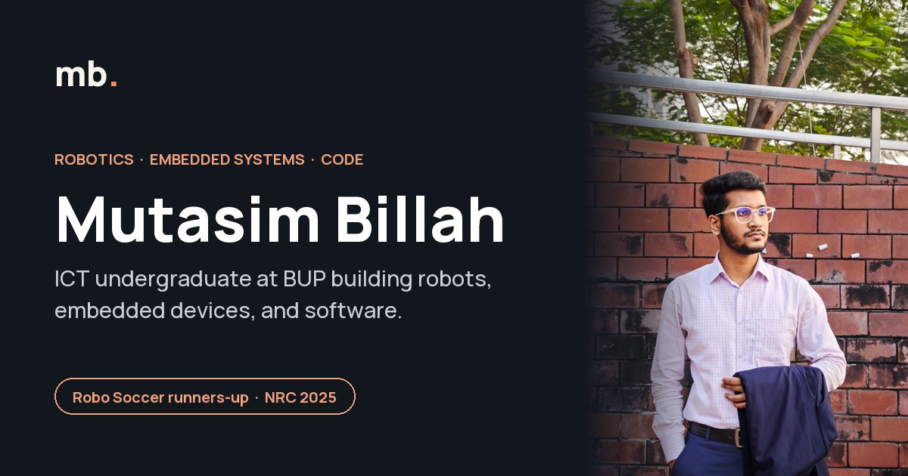
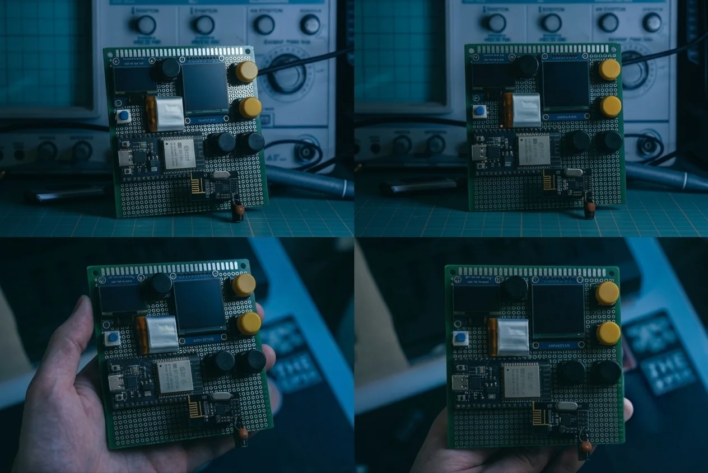
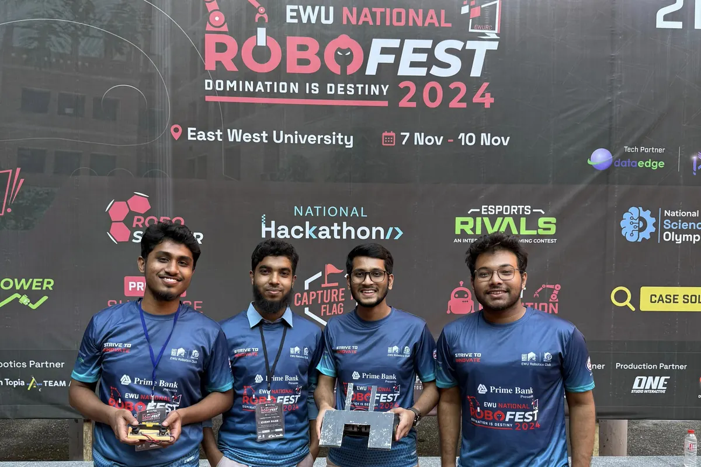
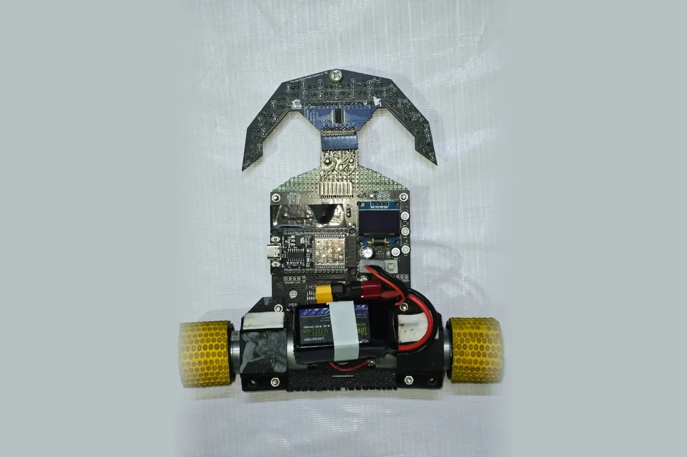

  

  <a href="https://1467mutasim-ctrl.github.io/MTB-Portfolio/"><b>Live portfolio</b></a> ·
  <a href="https://1467mutasim-ctrl.github.io/MTB-Portfolio/assets/Mutasim-Billah-CV.pdf">Download CV</a> ·
  <a href="https://www.linkedin.com/in/mutasim-billah-63a30439b/">LinkedIn</a> ·
  <a href="mailto:1467mutasim@gmail.com">Email</a>

---

## About me

I'm studying Information and Communication Engineering at **Bangladesh University of Professionals (BUP)**, batch 2023. I design around ESP32 and Arduino, write the firmware, and take my robots to national competitions. My soccer robot finished **runners-up at the National Robotics Championship 2025**.

Right now I'm learning PCB design and full-stack web development, and I'm open to internships and collaborations in robotics, embedded systems, and software. Away from the workbench, I photograph the world that keeps me curious.

## Featured projects

<table>
  <tr>
    <td width="33%"></td>
    <td width="33%"></td>
    <td width="33%"></td>
  </tr>
  <tr>
    <td><b>CPU Scheduler Visualizer</b> Handheld ESP32 device that steps through FCFS, SJF, SRTF, Priority, and Round Robin on two displays.</td>
    <td><b>Robo Soccer robot</b> Designed and built from scratch. Runners-up at NRC 2025, 4th at IUBAT.</td>
    <td><b>Line-following robots</b> Mark-X and Head Hunter: PD control, 16-sensor array, junction priority, and finish-box auto-stop.</td>
  </tr>
</table>

| Project | What it is | Built with |
|---|---|---|
| [CPU Scheduler Visualizer](https://github.com/1467mutasim-ctrl/CPU-Scheduler) | Teaches CPU scheduling with step-by-step playback, a live Gantt chart, scheduling metrics, and a Compare All mode | C++, ESP32, SSD1306, ST7789 |
| Robo Soccer robot | Competition soccer robot, designed and built from scratch | Robotics hardware |
| Pagla Ghora LFR | Line followers that handle gaps, junctions, and inverted sections | Arduino, ESP32, PD control |
| ESP32 builds | Wireless signal analyzer (Wi-Fi channels, Bluetooth scanning) and a smart clock with weather | ESP32, nRF24, OLED/IPS displays |
| [Art Attack](https://github.com/1467mutasim-ctrl/Art_Attack) | Art community and marketplace with team battles, moderation, checkout, and PDF receipts | Python, Flask, SQLAlchemy, MySQL |
| [Restaurant Management System](https://github.com/1467mutasim-ctrl/Restaurant-Management-System) | Staff roles, reservations, orders, and billing on a built-in web server | Java |
| Q-Less Printing *(in progress)* | Web-based printing service for the BUP Reproduction section | React, TypeScript, Node.js, PostgreSQL |

Team projects: **Aqua Guard** with Team DurontoJatra and **AgroBot** with Team QuadBits.

## Achievements

- **Runners-up, Robo Soccer**: National Robotics Championship 2025
- **Top 10, Robo Fusion (UFTB)** with Team DurontoJatra; qualified for the World SDG Challenge 2026 in Kuala Lumpur
- **4th place, Soccer Bot**: IUBAT Robotics Competition
- **5th place**: Machine Mania 3.0, BUTEX
- **Exhibited AgroBot** at Bangladesh Innovation Fair 2026 with Team QuadBits
- **Silver and bronze medals, Taekwondo**: National Games 2016 and 2017

## Leadership

- **Technical Team Head, Circuit Clash 1.0**: led technical operations for a national-level engineering competition
- **Technical Lead, SafetyPod**: led the technical work on a team-built safety device
- **Contributor, Soccer Bot Workshop**: helped participants with robot movement, control, and hardware integration

## Skills

- **Languages:** C, C++, Java, Python, SQL, HTML, CSS
- **Embedded & hardware:** ESP32, Arduino, ESP-IDF, PD motor control, sensor arrays and multiplexers, I²C/SPI displays, nRF24 radios
- **Software & tools:** Git, VS Code, Arduino IDE, Flask, SQLAlchemy, MySQL, PostgreSQL, MATLAB, Cisco Packet Tracer
- **Learning:** PCB design, React, TypeScript, Node.js

## Photography

The portfolio also has a section of my best photographs, each with the story behind it. [See them on the site](https://1467mutasim-ctrl.github.io/MTB-Portfolio/#photography).

## About this site

Hand-written HTML, CSS, and vanilla JavaScript with no framework or build step. It is deployed to GitHub Pages by a GitHub Actions workflow on every push to `main`, and the CV is generated from a JSON file with Python and ReportLab. To preview or update it, see [docs/MAINTAINING.md](docs/MAINTAINING.md).

## Contact

- Email: [1467mutasim@gmail.com](mailto:1467mutasim@gmail.com)
- LinkedIn: [mutasim-billah-63a30439b](https://www.linkedin.com/in/mutasim-billah-63a30439b/)
- GitHub: [1467mutasim-ctrl](https://github.com/1467mutasim-ctrl)

© 2026 Mutasim Billah

